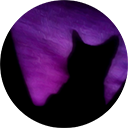

# Share cat images & GIF's

  

## Command List

| Command | Description |
| ------------- |:-------------:|
| /cathelp | Lists all available commands |
| /catmeow | Replies with generated large font "Meow" |
| /catmeow [to: "user"] | Replies to mentioned user with generated large font "Meow" |

### GIF Commands

| Command | Description |
| ------------- |:-------------:|
| /catgif                     | Replies with a random cat gif |
| /catgif [search: "value"]   | Replies with a gif according to the specified search (e.g cute, lonely, sad) |

### Image Commands

| Command | Description |
| ------------- |:-------------:|
| /cat                  | Replies with a random cat image or gif |
| /cat [tag: "value"]   | (Experimental) Replies with a image or gif according to the specified tag |
| /catmeme              | Replies with a cat meme |
| /catmemelove          | Replies with a in love cat meme |
| /catlove              | Replies with a in love cat image or gif |
| /catcasual            | Replies with a casual cat image or gif |
| /catfeels             | Replies with a image or gif of a cat that expresses any feeling |
| /catreact             | Replies with a reaction image or gif of a cat |
| /catmental            | Replies with a cat image or gif about mental health |
| /catedit              | Replies with a edited cat image or gif |

#### Additional Notes:

+ The cat images & GIF's comes from a database that I have prepared myself (By [Airtable](https://www.airtable.com/)), so there is not much image available at the moment. By joining the [Discord server](https://discord.gg/8ZRmukDVsa), you can send cat pictures and contribute.

* The bot uses [Giphy](https://giphy.com/) & [Tenor](https://tenor.com/) API services to provide GIF's.
* When searching for a gif only enter the related value (e.g /catgif sad).

 

